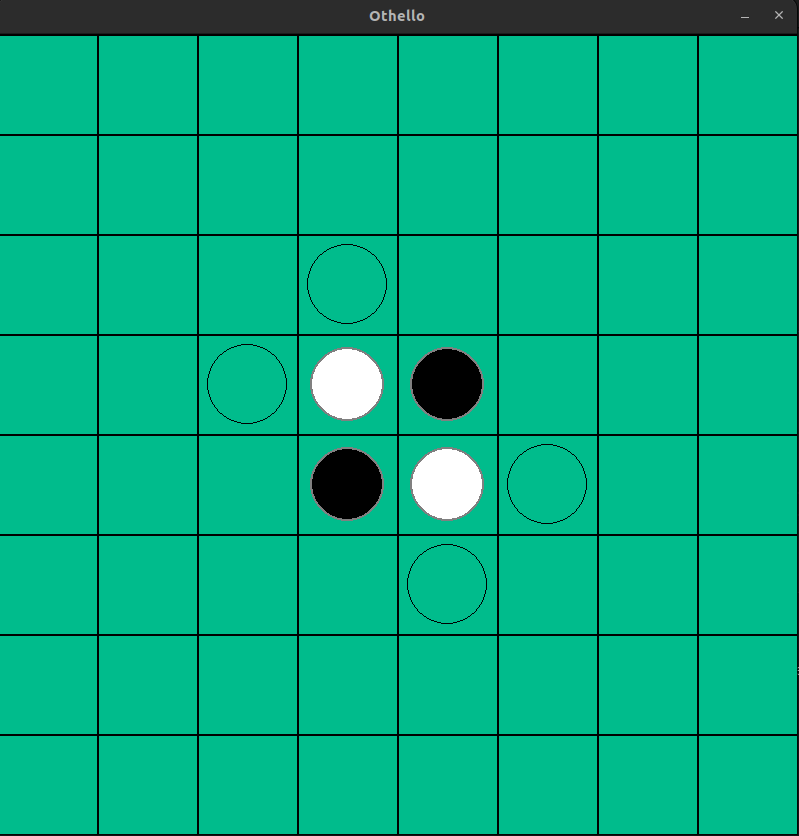
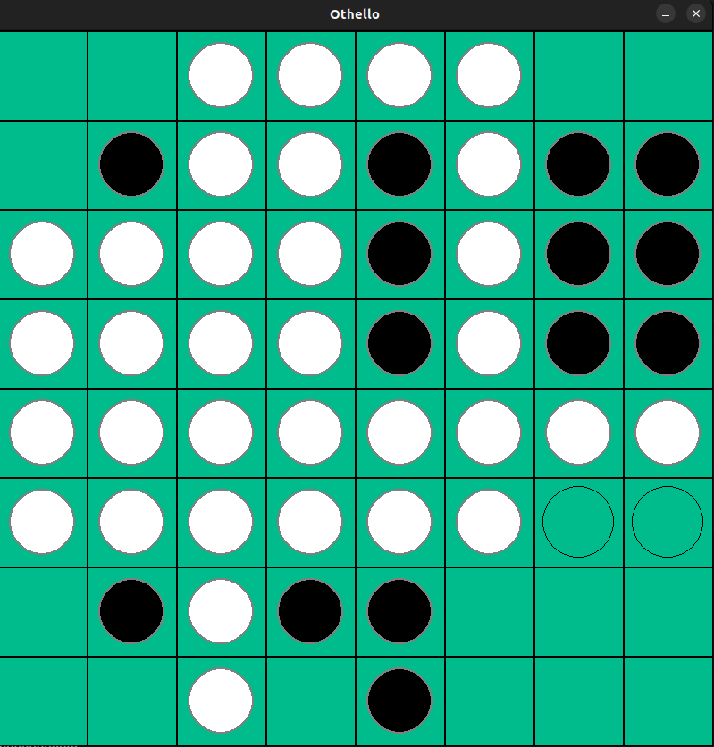

# Othello Game

This is a Python implementation of the classic board game Othello, also known as Reversi.

## Project Structure

The project is structured as follows:

- **game**: Contains modules related to the game logic and user interface.
  - `board.py`: Defines the Othello board and related functions.
  - `constants.py`: Contains constants used throughout the game.
  - `controller.py`: Manages the game state and user interactions.
  - `disk.py`: Defines the disk piece used in the game.
- **minimax**: Contains the implementation of the Minimax algorithm with Alpha-Beta Pruning for AI gameplay.
  - `minimaxAlgo.py`: Implements the Minimax algorithm with Alpha-Beta Pruning for AI moves.
- **main.py**: Main script to run the Othello game.

## Running the Game

To play the game, run `main.py` using Python. Ensure you have Pygame installed, as the game utilizes the Pygame library for the graphical user interface.

```bash
python main.py
```

## Gameplay

- The game starts with a board initialized with two disks for each player.
- Players take turns to place their disks on the board, with the objective of surrounding and capturing opponent's disks.
- The game ends when no more valid moves can be made by either player or when the board is full.
- The player with the most disks of their color on the board at the end wins.

## AI Player

- The game includes an AI player using the Minimax algorithm with Alpha-Beta Pruning.
- The difficulty level of the AI can be adjusted by changing the depth parameter in the Minimax algorithm implementation.
- The AI player calculates the best move based on the current board state and the specified depth level, using Alpha-Beta Pruning for improved efficiency.

## Game shots
initial state


late game state , note Computer is White


## Contributing

Contributions are welcome! Feel free to open issues for any bugs or suggestions for improvements. Pull requests are also appreciated.